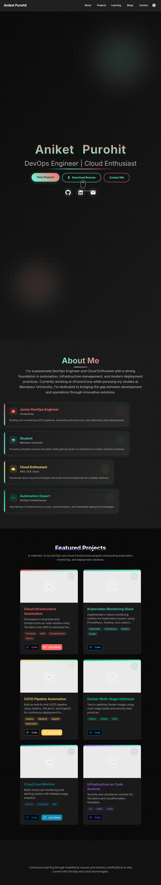
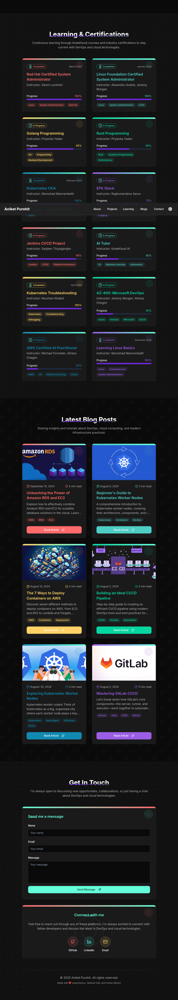

# 🌐 Modern Portfolio Website

> 🚀 **Live at:** [v0-modern-portfolio-website-gamma-lyart.vercel.app](https://v0-modern-portfolio-website-gamma-lyart.vercel.app/)

This is my personal portfolio built using [v0.dev](https://v0.dev) and deployed on [Vercel](https://vercel.com). It highlights my DevOps projects, certifications, blogs, and skills in a modern, clean UI.

---

---

## 📸 Screenshots

### 🖼️ Homepage + Projects

### 📚 Certifications + Blogs + Contact

---

## ✨ Overview

This repository stays in sync with my deployed app on [v0.dev](https://v0.dev). Any updates made in the v0 editor are automatically committed to this repo and deployed via Vercel.

---

## 🚀 Live Deployment

🔗 **Portfolio Link:**  
**[https://v0-modern-portfolio-website-gamma-lyart.vercel.app](https://v0-modern-portfolio-website-gamma-lyart.vercel.app/)**

---

## 🛠️ Build & Update

Continue developing the design here:  
👉 [v0.dev Project Editor](https://v0.dev/chat/projects/JFIVmaVwUhg)

---

## 🔁 How It Works

1. Build & modify using [v0.dev](https://v0.dev)
2. Deploy the UI via v0
3. Changes sync automatically to GitHub
4. Vercel redeploys the latest build

---

## 🧰 Tech Stack

- **Frontend Builder**: [v0.dev](https://v0.dev)
- **Hosting**: GitHub + Vercel
- **Tech**: React, Tailwind CSS (via v0)
- **Integrations**: Markdown, EmailJS, Badge Shields

---

## 🙌 Acknowledgements

Inspired by the power of serverless, AI-assisted UI building with [v0.dev](https://v0.dev). Hosted with love on [Vercel](https://vercel.com).

---
